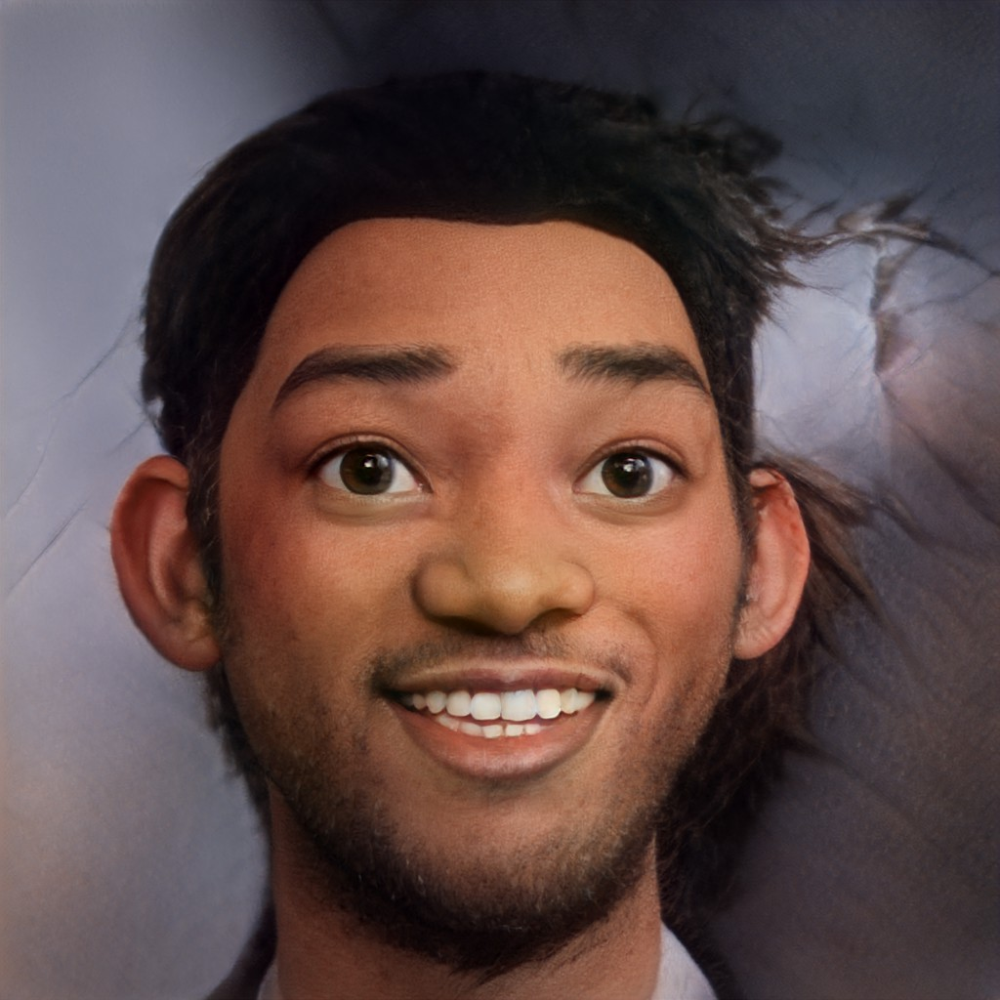
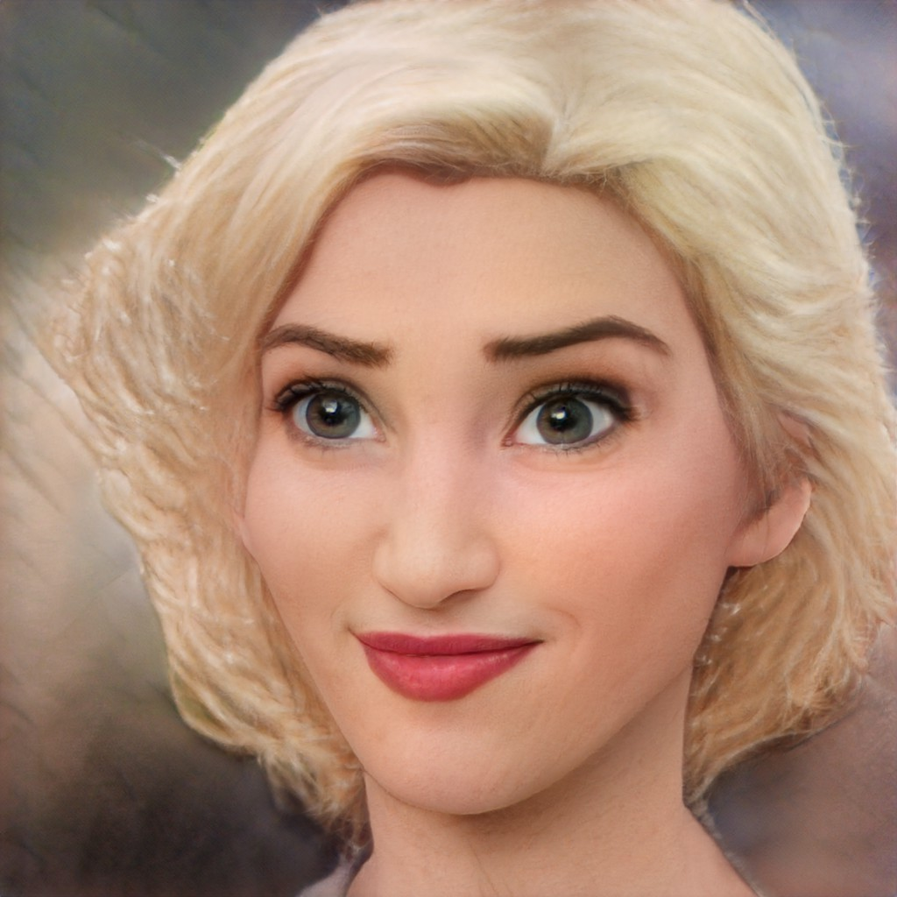
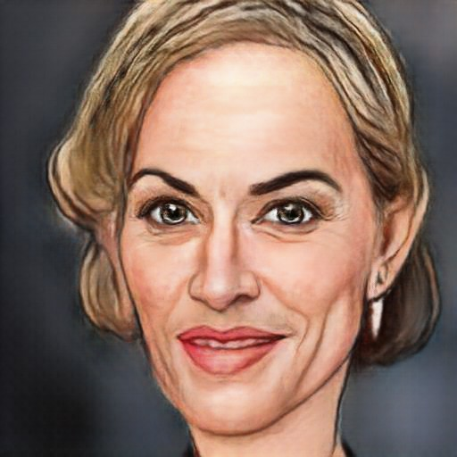

We currently provide API access to 4 different models. __Note the different models consume different numbers of Credits for each API call__

_NEW !_
## Toonify HD

- __Credits per call = 100__
- Endpoint: `v0/toonifyhd`
- Produces a toonify style image at 1024x1024 resolution
- Only available on the MEGA subscription

## Caricature

- __Credits per call = 4__
- Endpoint: `v0/caricature`
- Produces a caricature style image

## Toonify

- __Credits per call = 2__
- Endpoint: `v0/toonify`
- The original Toonify model

## Emojify

- __Credits per call = 4__
- Endpoint: `v0/emojify`
- Produces an emoji style image

## Zombify

- __Credits per call = 4__
- Endpoint: `v0/zombify`
- Zombie model from https://makemeazombie.com/

## Toonifyplus

- __Credits per call = 4__
- Endpoint: `v0/toonifyplus`
- Toon style image more faithful to original features and more noise resistant

## Halloweenify

- __Credits per call = 4__
- Endpoint: `v0/halloweenify`
- Zombie/horror like appearance

