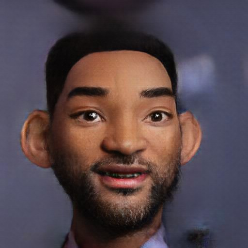

We currently provide API access to 4 different models. __Note the different models consume different numbers of Credits for each API call__

## Toonify

- Credits per call = 2
- Endpoint: `v0/toonify`
- The original Toonify model

## Emojify

- Credits per call = 4
- Endpoint: `v0/emojify`
- Produces an emoji style image

## Toonifyplus

- Credits per call = 4
- Endpoint: `v0/toonifyplus`
- Toon style image more faithful to original features and more noise resistant

## Halloweenify

- Credits per call = 4
- Endpoint: `v0/halloweenify`
- Zombie/horror like appearance

