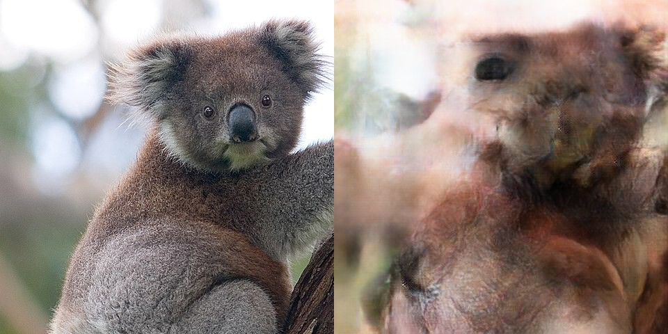

In the previous example you saw one query parameter that you can pass `return_aligned` to receive the original cropped face or not. There are a few other parameters that the API currently exposes:

- `face_index` (default: 0)
- `crop_edges` (default: 0)
- `proceed_without_face` (default: False)

## Indexing faces

One of the json response fields is `num_faces` this tells you how many faces were detected in the original image. If there are multiple faces in the image then you can toonify all of them by passing an extra query parameter of `face_index`. This zero based index controls which detected face will be sent for toonifcation.

```python
import requests

url = "https://toonify.p.rapidapi.com/v0/toonify"
query = {
        "x-rapidapi-host": "toonify.p.rapidapi.com",
        "x-rapidapi-key": "KEY_HERE",
        "accept": "application/json",
        "face_index": 1, # Process the second face in the image
        }
headers = {"accept": "application/json"}
files = {"image": open("imagefile.jpg", "rb")}

response = requests.request("POST", url, files=files, headers=headers, params=query)

print(response.json())
```

## Cropping edges

The original model processes images at 512x512 pixels. Sometimes these edges are quite low quality, especially if the original image is a tight crop. You can remove these and get a (slightly) faster response time by setting the `crop_edges` parameter to be greater than 0. Generally 16 is a good value, but multiples of 8 are recommended.

## Behaviour when no face is found

The `proceed_without_face` parameter controls the behaviour if no face is found. By default if no face is found the API returns an error. If you set `proceed_without_face` to be True, we will simply resize and process the full original image as is, the quality in this case is likely to not be good.



## Example with all the options

```python
import requests

url = "https://toonify.p.rapidapi.com/v0/toonify"
query = {
        "x-rapidapi-host": "toonify.p.rapidapi.com",
        "x-rapidapi-key": "KEY_HERE",
        "accept": "application/json",
        "face_index": 1, # Process the second face in the image
        "crop_edges": 16, # crop a 16 pixel border from the image
        "proceed_without_face": True, # Process even when no face is found
        }
headers = {"accept": "application/json"}
files = {"image": open("imagefile.jpg", "rb")}

response = requests.request("POST", url, files=files, headers=headers, params=query)

print(response.json())
```

__Next see [tips and considerations](tips and considerations) in using the API.__